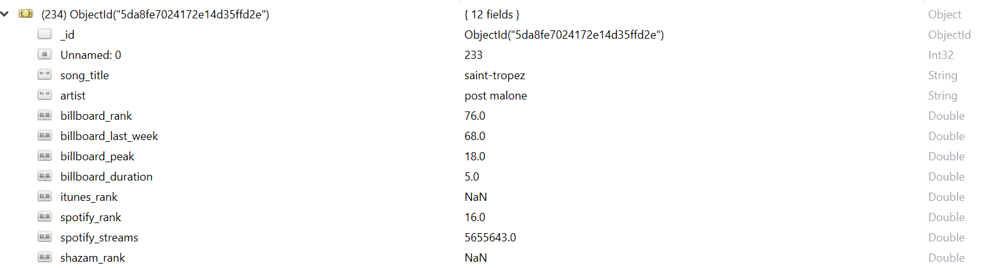

# ETL Project Group 4

Data sources:  
Top 200 song lists  
https://www.billboard.com/charts/billboard-200  
https://www.shazam.com/charts/top-200/united-states  
http://www.popvortex.com/music/charts/itunes-top-400-songs.php  
https://spotifycharts.com/regional/us/weekly/latest  

Transformations:  
Join data from various sites by Song Title  
Verify Song Titles match between sites  

Data to be loaded to Mongo:  
Song Title  
Artist  
Genre  
iTunes Rank  
Spotify Rank  
Billboard Rank  
Shazam Rank  
Spotify Stream Count  
Spotify Trend  
Billboard Last Week  
Billboard Peak  
Billboard Duration 

# Final Report

## Sources
We used data from the following popular music ranking sites:

* Billboards
    * scraped using BeautifulSoup, splinter, and selenium, stored as DataFrame and saved to CSV

* Shazam
    * scraped using BeautifulSoup, splinter, and selenium, stored as DataFrame and saved to CSV

* Itunes(popvortex)
    * I was able to scrape with pandas and load the html directly into pandas using the read_html method.

* Spotify 
    * Spotify provided a downloadable CSV file of the data. After downloading the data and formatting the data in Excel, we used pandas to create a dataframe.

We limited our data collection to the top 100 songs from each of the list
Each was saved as a CSV

## Transformation
iTunes had multiple records of the same song. We deleted the duplicates and kept the first.
When JOINing tables:

* Songs had varying capitalizations of letters. 
    * We converted all to lowercase.

* Some songs had spaces at the end. 
    * We used str.strip().

* Some lists put featuring artists on song title, and some on artist.
    * We used list comprehension to remove text before “(“ on song titles.

* Similar issues with artist names.
    * Instead of the solutions above, we used groupby on song title to combine artists.

* Still some song titles had special characters in the song title, that could only be seen in the CSV. 
    * No solution determined.

## Final tables & 
* The type of final production database to load the data into (relational or non-relational).

    * Since the data came from various sources, and each source provided slightly different data for each song, we decided to use a non-relational database to store the data.  This way each entry could contain slightly different data without causing an issue.

    * Loaded the csv file to pandas then used to_dict to insert into Mongo using pymongo.

## Type of final production database

* The final tables or collections that will be used in the production database.
    * Table of all songs with ranking from each website and various other characteristics

## Lessons Learned

* When website provides CSVs for download, it’s much easier
* Some data is more difficult to scrape than others (ex: icons)
* Data from different sources can be difficult to JOIN due to slight variations in names
* Issues when JOINing tables can go unfound without manually scanning through the data to find potential issues

